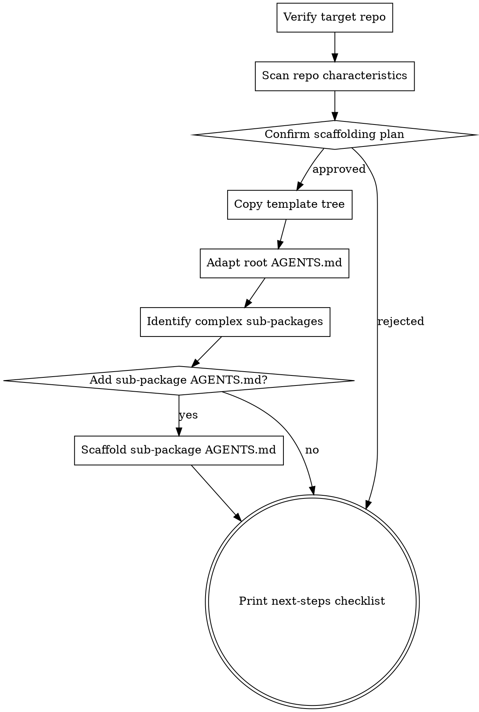

# Bootstrap Agent-First Documentation

## Overview

Scaffold a repository's documentation structure to follow **Agent-First Engineering** practices — "Human at the helm. Agents execute." The knowledge base is structured for agent readability with progressive disclosure: a small stable entry point (`AGENTS.md` ~100 lines) that points to deeper docs.

**Core principle:** Scaffold the structure, do NOT auto-generate content that will rot. Agents and humans fill in content iteratively as the project evolves.

**Template source:** This skill ships its template tree alongside itself in the plugin. The templates live at `${CLAUDE_PLUGIN_ROOT}/templates/` once the plugin is installed. Bind it once at the start of the run:

```bash
TEMPLATE_DIR="${CLAUDE_PLUGIN_ROOT}/templates"
[ -d "$TEMPLATE_DIR" ] || { echo "Template dir not found at $TEMPLATE_DIR — plugin may be corrupted"; exit 1; }
```

`${CLAUDE_PLUGIN_ROOT}` is set by Claude Code automatically when this plugin is enabled. If you are running this skill outside of a plugin install (e.g., from a cloned source tree), set `CLAUDE_PLUGIN_ROOT` to the path containing `templates/`.

## When to Use

**Use when:**
- Initializing a new repo with Agent-First docs baseline
- An existing repo has no `AGENTS.md` or has a bloated 1000+ line `AGENTS.md`
- Documentation is scattered with no INDEX, no clear convention
- The user explicitly asks to "apply our doc practices" or "bootstrap agent docs"

**Do NOT use when:**
- The repo already has a working `AGENTS.md` table-of-contents + `docs/` tree (just improve it incrementally)
- The user wants to write a single document (create that document directly)
- The user wants to add ONE specific rule/codemap (just create that file directly)

## Process



### Step 1: Verify Target Repo

- Confirm the user's target directory (do NOT assume current working directory).
- Check it is a git repo (`git rev-parse --show-toplevel`). If not, ask the user to confirm.
- Check for existing `AGENTS.md` / `docs/`. If present, ask whether to **merge** (preserve existing) or **replace** (overwrite). Default to merge.

### Step 2: Scan Repo Characteristics

Run quick detection and report findings to the user:

| Signal | Command | Used for |
|--------|---------|----------|
| Language | look at top extensions: `git ls-files \| sed 's/.*\.//' \| sort \| uniq -c \| sort -rn \| head -5` | Choose example rules to seed |
| Build system | look for `Makefile`, `package.json`, `pyproject.toml`, `go.mod`, `Cargo.toml` | Quick Reference table commands |
| Entry points | look for `cmd/*/main.go`, `src/index.*`, `main.py` | Architecture section in AGENTS.md |
| Sub-packages with potential complexity | `find . -type d \( -name internal -o -name pkg -o -name src -o -name lib \) -maxdepth 3` | Candidates for sub-package AGENTS.md |

Report what was detected. Do NOT proceed silently.

### Step 3: Confirm Scaffolding Plan

Before writing any files, summarize what will be created:

```
Will create in <target>:
- AGENTS.md (root, ~100 lines, table of contents)
- docs/codemaps/INDEX.md
- docs/rules/{INDEX,non-derivability,document-conventions,openai-harness-engineering}.md
- docs/{troubleshoot,runbooks,lib,verify,design,plans}/INDEX.md
- docs/_templates/{codemap,design,plan,subpackage-AGENTS}.md
```

Get user approval before creating files.

### Step 4: Copy Template Tree

Source: `$TEMPLATE_DIR` (resolved in Overview — `${CLAUDE_PLUGIN_ROOT}/templates/`).

Both strategies below use `--ignore-existing` so the target's `.gitignore`, `AGENTS.md`, or any pre-existing file is never overwritten.

**Strategy A — fresh repo (no existing AGENTS.md/docs):**
```bash
rsync -av --ignore-existing "$TEMPLATE_DIR/" <target>/
```

**Strategy B — existing repo (merge, never overwrite):**
```bash
rsync -av --ignore-existing "$TEMPLATE_DIR/" <target>/
# Then list what's new and what was skipped:
cd <target> && git status
```

After copy, run `cd <target> && git status` to see exactly what was created. If the user wants to overwrite a specific file, copy it explicitly after confirming.

### Step 5: Adapt Root AGENTS.md

The copied `AGENTS.md` contains two kinds of placeholders:

- **`{{NAME}}`** — single values to replace (e.g., `{{PROJECT_NAME}}`, `{{BUILD_COMMAND}}`). Replace with detected values, or leave the placeholder if you can't determine it.
- **`<!-- TODO: ... -->`** — prose hints for sections the human needs to flesh out. Leave the comment in place until the human fills the section in. Delete the comment only when its row/section is confirmed N/A.

Search both with:
```bash
grep -rn '{{' <target>/AGENTS.md <target>/docs/
grep -rn 'TODO:' <target>/AGENTS.md <target>/docs/
```

For values you cannot detect from the repo scan, leave the `{{...}}` placeholder untouched — the user will fill it in.

**Critical:** Keep root `AGENTS.md` under ~150 lines. If you find yourself adding more, link to a doc in `docs/` instead.

### Step 6: Identify Complex Sub-Packages

A sub-package warrants its own `AGENTS.md` when ANY of:

| Condition | Threshold |
|-----------|-----------|
| State machine | Has explicit state transitions, phase flow |
| High complexity | Single file > 800 LoC, or package total > 3000 LoC |
| Cross-module constraints | Changes require updates in multiple docs/configs |
| Special error handling | Retry, compensation, rollback logic |
| High test complexity | > 5 test files or has integration tests |

For each candidate, ASK the user before creating — do not auto-create. Sub-package `AGENTS.md` template is in `$TEMPLATE_DIR/docs/_templates/subpackage-AGENTS.md`.

### Step 7: Next-Steps Checklist

Print this for the user (the agent is done; the user/agent iterates from here):

```
Bootstrap complete. Next steps for you/the agent:

1. Fill placeholders in AGENTS.md (search for "TODO:" markers)
2. (Optional) Use the agent-docs manual skills for ongoing memory maintenance:
   /agent-docs:learn
   /agent-docs:remember
   If this repo was scaffolded without the plugin installed, install it first:
   claude plugin marketplace add gzb1128/agent-docs-template
   claude plugin install agent-docs@agent-docs-plugins
3. If useful, write your first code map: docs/codemaps/<component>.md
   - Apply the non-derivability principle (docs/rules/non-derivability.md)
   - Use the "map, not encyclopedia" pattern (docs/rules/openai-harness-engineering.md)
4. Add project-specific coding rules under docs/rules/, update docs/rules/INDEX.md
5. Add the first design doc when you have a non-obvious decision to record:
   docs/design/YYYY-MM-DD-<topic>-design.md
6. Commit the baseline: `git add . && git commit -m "docs: bootstrap agent-first documentation baseline"`
```

## Quick Reference

| Action | Where |
|--------|-------|
| Template source | `${CLAUDE_PLUGIN_ROOT}/templates/` (set automatically when plugin is enabled) |
| Root AGENTS.md placeholder list | `$TEMPLATE_DIR/AGENTS.md` (grep for `{{`) |
| Sub-package AGENTS.md template | `$TEMPLATE_DIR/docs/_templates/subpackage-AGENTS.md` |
| OpenAI Harness reference | `$TEMPLATE_DIR/docs/rules/openai-harness-engineering.md` |
| Document conventions | `$TEMPLATE_DIR/docs/rules/document-conventions.md` |

## Golden Rules (enforce while scaffolding)

1. **Root `AGENTS.md` is a table of contents, not an encyclopedia.** Target ~100 lines.
2. **Progressive disclosure.** Each level points to the next, never duplicates content.
3. **INDEX.md per category.** Every `docs/*/` subdir has an INDEX.md mapping topic → file.
4. **Code maps are maps.** Tables of concept → file path, never copy code into docs.
5. **Naming conventions.**
   - Design: `docs/design/YYYY-MM-DD-<topic>-design.md`
   - Plan: `docs/plans/YYYY-MM-DD-<feature>.md`
6. **Sub-package AGENTS.md only when justified.** Do not over-scaffold.

## Common Mistakes

| Mistake | Fix |
|---------|-----|
| Copying the template AGENTS.md verbatim with placeholders unfilled | Always replace `{{...}}` or add `TODO:` markers explicitly |
| Auto-generating code maps from `tree`/AST scans | Don't. They rot in days. Let humans/agents write them when actually needed |
| Creating sub-package AGENTS.md for every package | Only for state machines, complex modules, cross-cutting constraints |
| Skipping the user approval step (Step 3) | Always confirm scope before mass-creating files |
| Forgetting to merge instead of overwrite on existing repos | Default to merge; only overwrite with explicit user consent |

## Anti-Patterns (do NOT do)

- **One giant `AGENTS.md`** — kills agent context, contains stale rules, can't be verified mechanically
- **Nested `docs/x/y/z/`** — flat is better; use purpose-specific subdirs only
- **`docs/codemaps/*.md` containing copy-pasted config or function bodies** — link to source files instead
- **`docs/rules/INDEX.md` missing "When to Use" column** — agents need triggering signals, not just titles

## Red Flags — Stop and Reconsider

- About to create > 20 files without user approval → STOP, ask
- About to generate a code map by reading source → STOP, that's the human/agent's job after bootstrap
- AGENTS.md drifting past 200 lines → STOP, move detail into `docs/`
- Sub-package AGENTS.md being created for a leaf package → STOP, not justified
