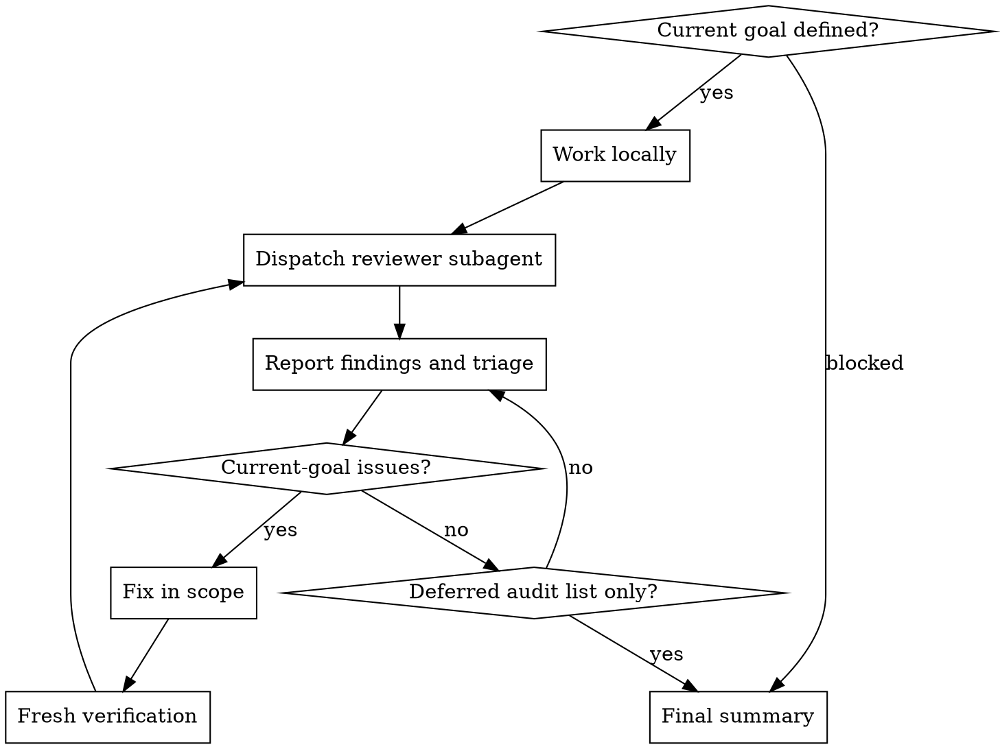

# Loopfix

## Overview

Loopfix is an autonomous work-review-fix loop for the current approved goal. The main agent owns triage and momentum: reviewer subagents advise, but the main agent decides what to fix now, what to reject, and what to defer for final human audit.

**Core rule:** meaningful in-scope changes reset the loop. Do not finish until a reviewer pass after the latest meaningful change finds no unresolved current-goal issue and verification is fresh.

## Workflow



1. Re-read the approved design, plan, or current user goal. Define the scope boundary before fixing.
2. Implement or repair the next in-scope slice yourself.
3. Dispatch at least one reviewer subagent scoped to the goal, diff, tests, and risk areas. Ask for correctness bugs, regressions, missing tests, edge cases, and overbroad changes.
4. Report the review result in the conversation: findings, accepted fixes, rejected findings, deferred audit items, and next action.
5. Fix accepted current-goal issues. Verify with the smallest meaningful command first, then broader checks when risk warrants it.
6. Repeat review after meaningful code, test, behavior, schema, API, UX, or config changes.
7. Stop only when verification is fresh and the latest reviewer pass has no unresolved current-goal issues.

## Triage Rules

| Finding | Action |
|---|---|
| Bug, regression, missing required test, broken requirement | Fix now, verify, review again |
| Ambiguous detail with local precedent | Choose the conservative local pattern, report decision |
| Reviewer is wrong or speculative | Reject with code/test evidence |
| Broad architecture, migration, contract, security, data, or product impact | Post a nonblocking note, defer unless it blocks safe completion |
| Unrelated cleanup or neighboring-package polish | Defer to final audit |

Broad or unrelated items do not stop loopfix by default. Keep working on the current goal. Only stop if the current goal cannot be completed safely without a human decision.

## Required Reporting

After each reviewer pass, send a brief working update:

```text
Reviewer pass N found:
- Fixing now: <in-scope issues>
- Rejecting: <finding + evidence>
- Deferring for final audit: <broad/unrelated items>
Next: <fix/verify/review action>
```

Final response must include:
- loop count and latest reviewer result
- fixes made
- verification commands and results
- deferred audit items the agent decided not to fix now
- residual risk or blockers, if any

## Red Flags

- "One review pass is enough" after meaningful changes
- "The user wants concise updates, so I will hide review triage until final"
- "The reviewer mentioned it, so I should fix everything"
- "This is broad, so I should stop and wait" when it can be deferred
- "Targeted tests passed, so no reviewer is needed"

## Rationalizations

| Excuse | Reality |
|---|---|
| "Bounded review-and-fix pass, not an open-ended loop" | Loopfix is bounded by current-goal cleanliness, not by one pass. |
| "Use one reviewer/subagent" | Use at least one per iteration. Meaningful changes require another review. |
| "Reviewer noise wastes time" | Triage noise; do not remove the review loop. |
| "Asking the user is safer" | Main agent owns normal triage. Defer broad items and keep moving. |
| "Fixing all comments is thorough" | Overfixing broad or unrelated items violates scope control. |

## Common Mistakes

- Letting the subagent decide scope. The main agent must inspect findings and own the decision.
- Running review before reconstructing the current goal. Review without scope creates noisy refactors.
- Treating deferred audit items as hidden work. Report them when found and summarize them at the end.
- Claiming ready while checks are stale. Any accepted fix requires fresh relevant verification.
